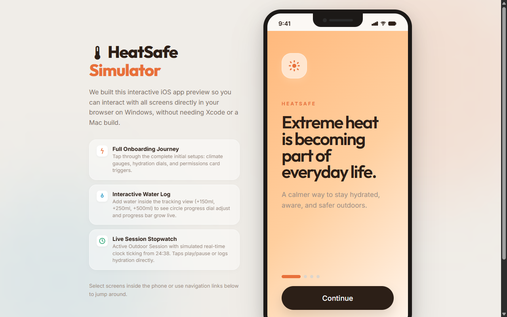
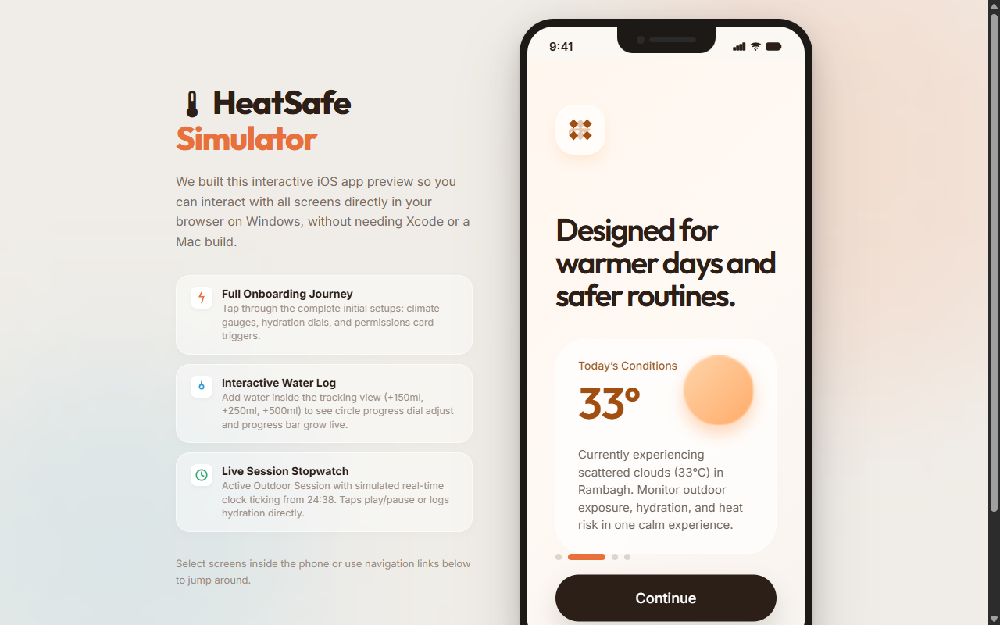
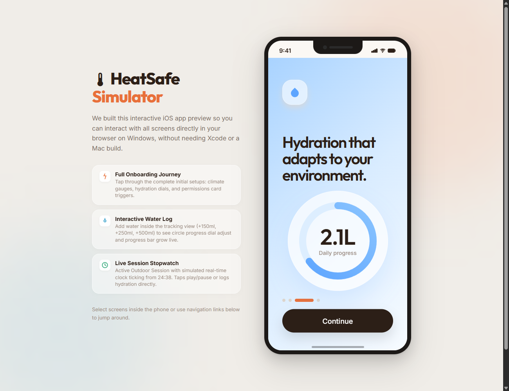
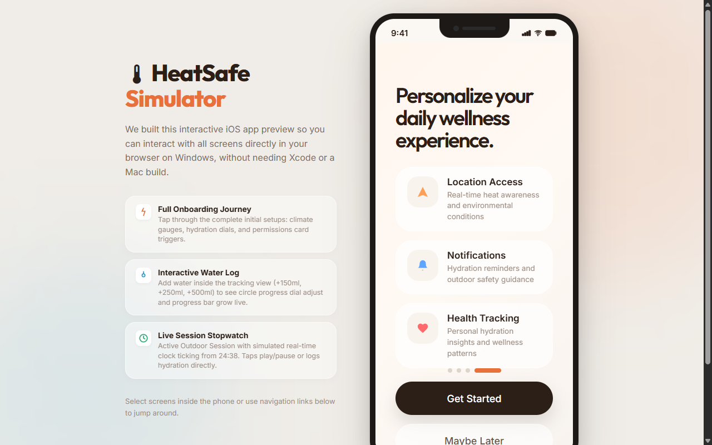
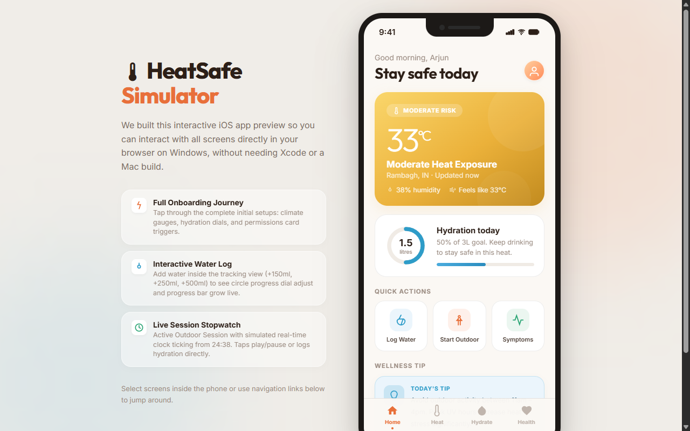
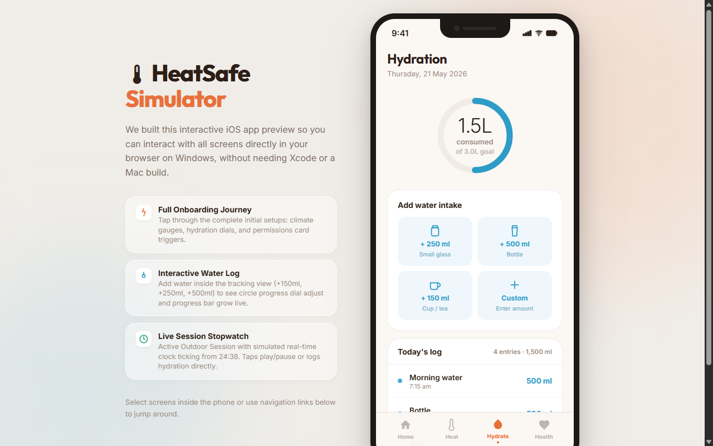
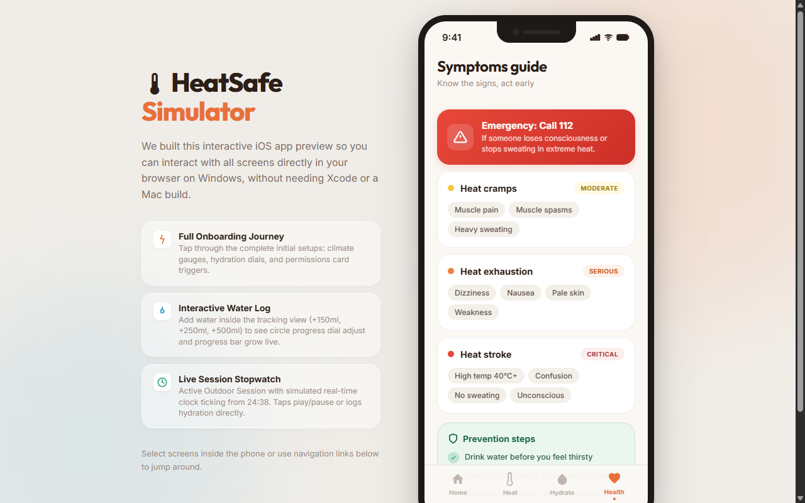
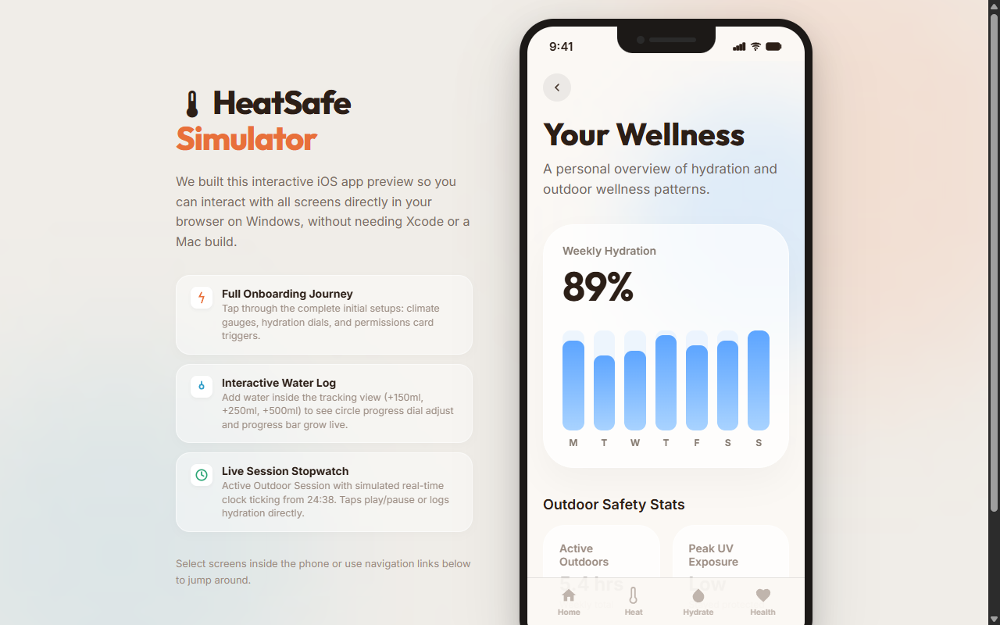
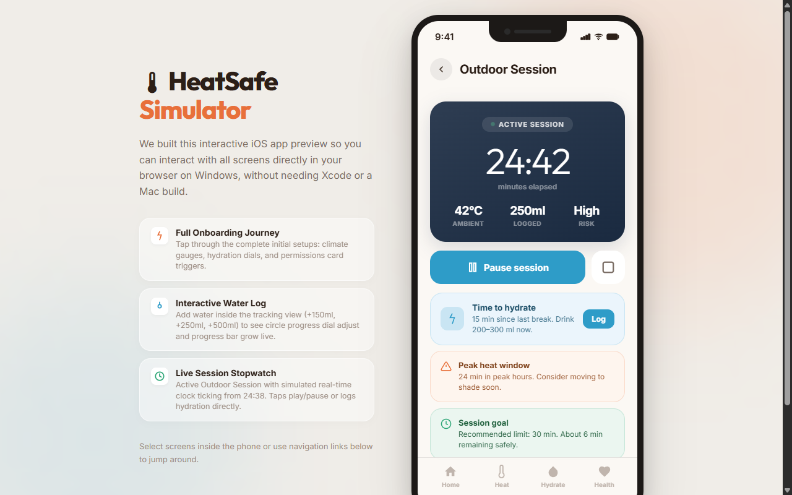

# 📱 HeatSafe — Application Screens Preview

This file provides a visual preview of all screens in the **HeatSafe** application (SwiftUI iOS translation & interactive simulator). 

---

## 📹 Interactive Video Walkthrough
* **Local File**: [recording.webm](file:///c:/Users/yaksh/Downloads/bharat%20engine/heat%20safe/HeatSafe/screenshots/recording.webm)
* **GitHub Link**: [View Recording on GitHub](https://github.com/yaksharth/HeatSafe-iOS/blob/main/HeatSafe/screenshots/recording.webm)

---

## 📸 Screenshots Gallery

### 1. Onboarding Entrance
Displays the welcome screen introducing HeatSafe's main purpose.
* **Local Link**: [1_onboarding.png](file:///c:/Users/yaksh/Downloads/bharat%20engine/heat%20safe/HeatSafe/screenshots/1_onboarding.png)
* **Preview**:
  

---

### 2. Climate Configuration Onboarding
Allows users to setup their baseline heat tolerance parameters.
* **Local Link**: [2_climate.png](file:///c:/Users/yaksh/Downloads/bharat%20engine/heat%20safe/HeatSafe/screenshots/2_climate.png)
* **Preview**:
  

---

### 3. Daily Hydration Target Setting
Sets up the hydration tracking targets during onboarding.
* **Local Link**: [3_hydrationIntro.png](file:///c:/Users/yaksh/Downloads/bharat%20engine/heat%20safe/HeatSafe/screenshots/3_hydrationIntro.png)
* **Preview**:
  

---

### 4. System Permissions Onboarding
Prompts users for Location and Notification permissions needed for weather fetching.
* **Local Link**: [4_permissions.png](file:///c:/Users/yaksh/Downloads/bharat%20engine/heat%20safe/HeatSafe/screenshots/4_permissions.png)
* **Preview**:
  

---

### 5. Home Dashboard
The central hub showing active feels-like temperatures, weather descriptions, dynamic warning alerts, and quick actions.
* **Local Link**: [5_home.png](file:///c:/Users/yaksh/Downloads/bharat%20engine/heat%20safe/HeatSafe/screenshots/5_home.png)
* **Preview**:
  

---

### 6. Hydration Tracker
Shows the 50% target tracker ring, add-water logs, and history of logged quantities.
* **Local Link**: [6_hydration.png](file:///c:/Users/yaksh/Downloads/bharat%20engine/heat%20safe/HeatSafe/screenshots/6_hydration.png)
* **Preview**:
  

---

### 7. Symptoms Checklist & SOS
Displays warnings, cramps, heat exhaustion symptoms, prevention tips, and an SOS call trigger.
* **Local Link**: [7_symptoms.png](file:///c:/Users/yaksh/Downloads/bharat%20engine/heat%20safe/HeatSafe/screenshots/7_symptoms.png)
* **Preview**:
  

---

### 8. Profile & Weekly Statistics
Interactive progress bars displaying weekly statistics, parameters configuration, and user details.
* **Local Link**: [8_profile.png](file:///c:/Users/yaksh/Downloads/bharat%20engine/heat%20safe/HeatSafe/screenshots/8_profile.png)
* **Preview**:
  

---

### 9. Active Outdoor Stopwatch Session
Shows the stopwatch tracking outdoor activity duration, logged water during the session, and peak limit alerts.
* **Local Link**: [9_session.png](file:///c:/Users/yaksh/Downloads/bharat%20engine/heat%20safe/HeatSafe/screenshots/9_session.png)
* **Preview**:
  
